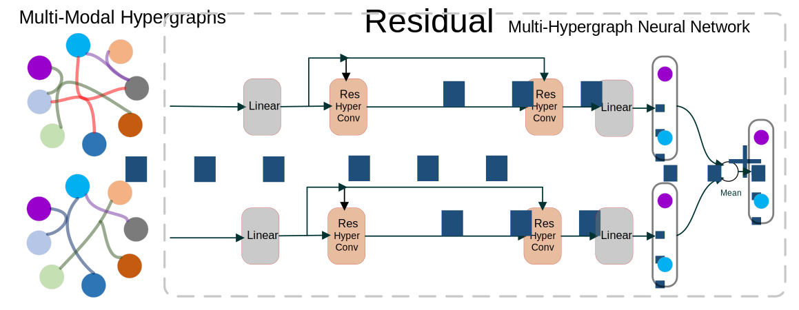

# ResMultiHGNN

This repository contains the source code for the paper [_Residual Enhanced Multi-Hypergraph Neural Network_](https://arxiv.org/abs/2105.00490).





## Getting Started

### Prerequisites

Our code requires Python>=3.6. 

We recommed using virtual environtment and  install the newest versions of  [Pytorch](https://pytorch.org/).


You also need these additional packages:

* scipy
* numpy
* path


### Datasets

Please download the precomputed features of ModelNet40 and NTU2012 datasets from [HGNN](https://github.com/iMoonLab/HGNN) or just clicking the following links.

- [ModelNet40_mvcnn_gvcnn_feature](https://drive.google.com/file/d/1euw3bygLzRQm_dYj1FoRduXvsRRUG2Gr/view?usp=sharing)
- [NTU2012_mvcnn_gvcnn_feature](https://drive.google.com/file/d/1Vx4K15bW3__JPRV0KUoDWtQX8sB-vbO5/view?usp=sharing)


Extract above files and put them under any directory (`$DATA_ROOT`) you like.

## 3D Object Classification Task

We implement the `HGNN`, `MultiHGNN`, `ResHGNN` and `ResMultiHGNN`. You can change the `$model` and the layers `$layer`.

### Full Training Lables

```sh
python train.py --dataroot=$DATA_ROOT --dataname=ModelNet40  --seed=2  --model-name=$model --nlayer=$layer; 

python train.py --dataroot=$DATA_ROOT --dataname=NTU2012     --seed=1  --model-name=$model --nlayer=$layer; 
```

### Balanced Subset of Training Labels

```sh
python train.py --dataroot=$DATA_ROOT --dataname=ModelNet40  --model-name=$model --nlayer=$layer --balanced; 

python train.py --dataroot=$DATA_ROOT --dataname=NTU2012     --model-name=$model --nlayer=$layer --balanced; 
```


## Stability Analysis

Change the split-ratio as you like.

```sh
python train.py --dataroot=$DATA_ROOT --dataname=ModelNet40   --model-name=$model --nlayer=$layer --split-ratio=4; 

python train.py --dataroot=$DATA_ROOT --dataname=NTU2012      --model-name=$model --nlayer=$layer --split-ratio=4; 
```

## Usage

```
usage: ResMultiHGNN [-h] [--dataroot DATAROOT] [--dataname DATANAME]
                    [--model-name MODEL_NAME] [--nlayer NLAYER] [--nhid NHID]
                    [--dropout DROPOUT] [--epochs EPOCHS]
                    [--patience PATIENCE] [--gpu GPU] [--seed SEED]
                    [--nostdout] [--balanced] [--split-ratio SPLIT_RATIO]
                    [--out-dir OUT_DIR]

optional arguments:
  -h, --help            show this help message and exit
  --dataroot DATAROOT   the directary of your .mat data (default:
                        /home/jing/data/HGNN)
  --dataname DATANAME   data name (ModelNet40/NTU2012) (default: NTU2012)
  --model-name MODEL_NAME
                        (HGNN, ResHGNN, MultiHGNN, ResMultiHGNN) (default:
                        HGNN)
  --nlayer NLAYER       number of hidden layers (default: 2)
  --nhid NHID           number of hidden features (default: 128)
  --dropout DROPOUT     dropout probability (default: 0.5)
  --epochs EPOCHS       number of epochs to train (default: 600)
  --patience PATIENCE   early stop after specific epochs (default: 200)
  --gpu GPU             gpu number to use (default: 0)
  --seed SEED           seed for randomness (default: 1)
  --nostdout            do not output logging info to terminal (default:
                        False)
  --balanced            only use the balanced subset of training labels
                        (default: False)
  --split-ratio SPLIT_RATIO
                        if set unzero, this is for Task: Stability Analysis,
                        new total/train ratio (default: 0)
```

## License

Distributed under the MIT License. See `LICENSE` for more information.


